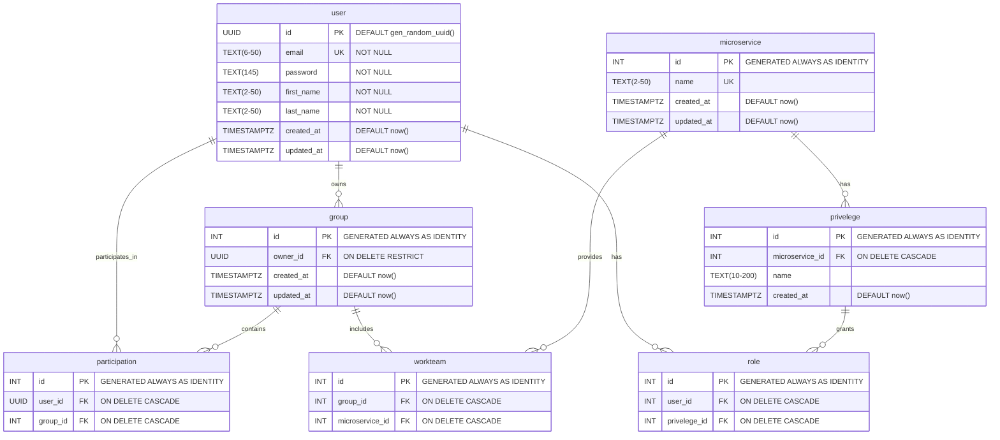

# HTTP-микросервивс авторизации
Необходимо реализовать микросервис для работы с привилегиями пользователей (создание/
удаление пользователя, добавить/убрать права пользователя, проверка прав пользователя). Сервис 
должен предоставлять HTTP API и принимать/отдавать запросы/ответы в формате JSON.

## Содержание
- [Технологии](#технологии)
- [Начало работы](#начало-работы)
- [Тестирование](#тестирование)
- [Deploy и CI/CD](#deploy-и-ci/cd)
- [Contributing](#contributing)
- [To do](#to-do)
- [Команда проекта](#команда-проекта)

## Технологии
- [Golang1.23.1 darwin/arm64](https://www.gatsbyjs.com/)
- [TypeScript](https://www.typescriptlang.org/)
- ...

## Использование
Расскажите как установить и использовать ваш проект, покажите пример кода:

Установите npm-пакет с помощью команды:
```sh
$ npm i your-awesome-plugin-name
```

И добавьте в свой проект:
```typescript
import { hi } from "your-awesome-plugin-name";

hi(); // Выведет в консоль "Привет!"
```

## Разработка

### Требования
Для установки и запуска проекта, необходим [NodeJS](https://nodejs.org/) v8+.

### Установка зависимостей
Для установки зависимостей, выполните команду:
```sh
$ npm i
```

### Запуск Development сервера
Чтобы запустить сервер для разработки, выполните команду:
```sh
npm start
```

### Создание билда
Чтобы выполнить production сборку, выполните команду: 
```sh
npm run build
```

## Тестирование
Какие инструменты тестирования использованы в проекте и как их запускать. Например:

Наш проект покрыт юнит-тестами Jest. Для их запуска выполните команду:
```sh
npm run test
```

## Deploy и CI/CD
Расскажите, как развернуть приложение. Как запустить пайплайны и т.д.

## Contributing
Как помочь в разработке проекта? Как отправить предложение или баг-репорт. Как отправить доработку (оформить pull request, какие стайлгайды используются). Можно вынести в отдельный файл — [Contributing.md](./CONTRIBUTING.md).

## FAQ 
Если потребители вашего кода часто задают одни и те же вопросы, добавьте ответы на них в этом разделе.

### Зачем вы разработали этот проект?
Чтобы был.

## To do
- [x] Добавить крутое README
- [ ] Всё переписать
- [ ] ...

## Команда проекта
Оставьте пользователям контакты и инструкции, как связаться с командой разработки.

- [Богдан Звягинцев](tg://resolve?domain=bzvyagintsev) — Front-End Engineer

## Источники
Если вы чем-то вдохновлялись, расскажите об этом: где брали идеи, какие туториалы смотрели, ссылки на исходники кода. 

